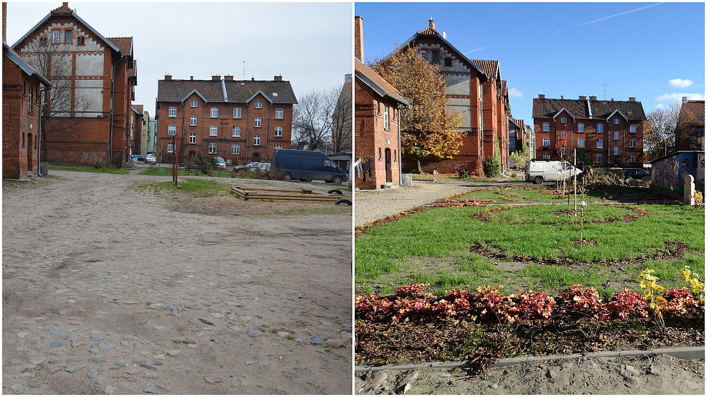

### Podwórka z Natury

“Podwórka z Natury” to konkurs Urzędu Miasta w którym mieszkańcy wybranych osiedli mogą uzyskać 60 tys zł na rewitalizację swojego podwórka i sfinansować nasadzenia, elementy małej architektury, murale, rzeźby lub instalacje artystyczne. Projekty podwórek pomagają przygotować studenci Architektury Krajobrazu UWM. Łącznie zrewitalizowano 15 miejsc na przestrzeni 5 lat. 

Dotyczy terenów objętych Miejskim Planem Rewitalizacji, czyli osiedla Zatorze, Śródmieście, Grunwaldzkie oraz część Wojska Polskiego, Kętrzyńskiego, Kościuszki, Podgrodzie, Kormoran, Pojezierze i Nad Jeziorem.

Nie znalazłem konretnych kosztów realizacji, ale zakładając stałą kwotę przeznaczoną per podwórko (60 tys zł) to łączny maksymalny koszt projektu wyniósł 900 tys. zł.

Na [stronie](https://olsztyn.eu/gospodarka/rewitalizacja/podworka-z-natury-realizacje.html) Urzędu Miasta dostępnych jest kilka zestawień Przed/Po - niesty strony nie wyświetla ich poprawnie. Jedno z porównań (Podwórko przy ul. Żeromskiego 34) poniżej. 

Wrzuciłem lokalizację podwórek na mapę. Odwiedzenie wszystkich miejsc to ok. godzinny spacer pozwalający odwiedzić ciekawe miejsca m.in. w centrum i na zatorzu. 

[Mapa]() (Google My Maps) - [Przykładowa trasa spaceru]() (Google Maps) - [Lista podwórek]() (Arkusz Google) 

Miejski Plan Rewitalizacji:
* [Strona Urzędu Miasta](https://olsztyn.eu/gospodarka/rewitalizacja/mpr-2020.html)
* [Uchwała Rady Miasta (BIP)](http://bip.olsztyn.eu/bip/dokument/372287/xxvii_470_20_zmieniajaca_uchwale_nr_xxiv_345_16_rady_miasta_olsztyna_z_dnia_29_czerwca_2016_r_w_sprawie_przyjecia_miejskiego_programu_rewitalizacji_olsztyna_2020_r/)

<iframe src="https://www.google.com/maps/d/u/0/embed?mid=1AgvLWlI-Z4zPm8aus7lv756rYYJsCOv6" width="640" height="480"></iframe>

Powinienem coś poprawić lub dodać? Napisz proszę na [pawel@olsztynwskrocie.pl](mailto:pawel@olsztynwskrocie.pl)

Strony związane z projektem:
* [https://olsztyn.eu/gospodarka/rewitalizacja/podworka-z-natury.html](https://olsztyn.eu/gospodarka/rewitalizacja/podworka-z-natury.html)
* [https://www.facebook.com/podworkaznatury/](https://www.facebook.com/podworkaznatury/)
* [https://www.facebook.com/podworka2018/](https://www.facebook.com/podworka2018/)
* [https://tmo.olsztyn.pl/podworka/](https://tmo.olsztyn.pl/podworka/)