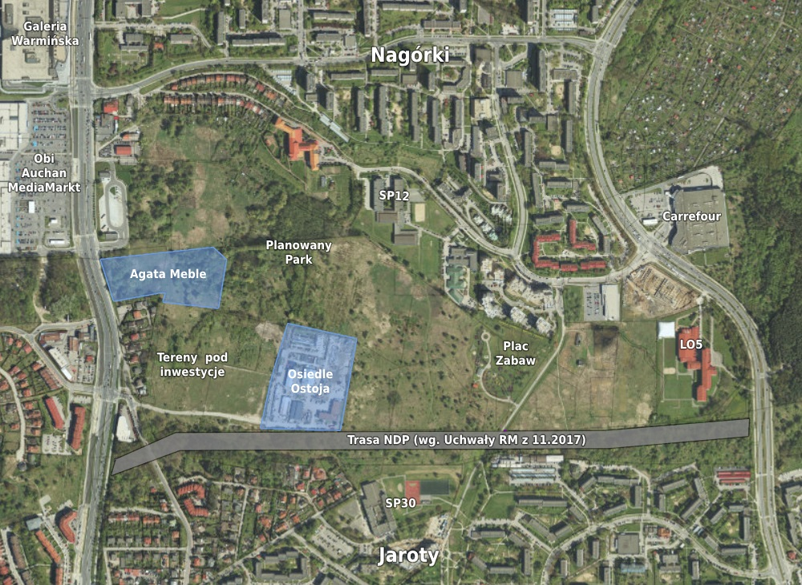

### Trasa NDP (Nauka-Dom-Praca)

Projekt nowej drogi, którego początek sięga lat 80 XX w. 

W listopadzie 2017 roku Rada Miasta uchwaliła miejscowy plan zagospodarowania przestrzennego terenu pomiędzy Nagórkami i Jarotami, wraz z planowanym wówczas przebiegiem trasy.

<a href="http://bip.olsztyn.eu/bip/dokument/338908/xlii_806_17_w_sprawie_uchwalenia_miejscowego_planu_zagospodarowania_przestrzennego_dla_terenu_polozonego_pomiedzy_nagorkami_i_jarotami_w_olsztynie_czesc_b_/?utm_campaign=Olsztyn-W-Skrocie-Newsletter&utm_medium=www&utm_source=OlsztynWskrocie.pl" target="_blank">Uchwała Rady Miasta</a> (29.11.2017)

W marcu 2021 pojawiły się kolejne informacje nt. realizacji.

Źródła:
<a href="https://olsztyn.wyborcza.pl/olsztyn/7,48726,26891157,powrot-do-budowy-nowej-ulicy-w-olsztynie-ktorej-plany-powstaly.html?utm_campaign=Olsztyn-W-Skrocie-Newsletter&utm_medium=www&utm_source=OlsztynWskrocie.pl" target="_blank">Wyborcza Olsztyn</a> - <a href="https://tko.pl/77966,2021,03,18,ma-powstac-nowa-ulica-miedzy-jarotami-a-nagorkami?utm_campaign=Olsztyn-W-Skrocie-Newsletter&utm_medium=www&utm_source=OlsztynWskrocie.pl" target="_blank">Twój Kurier Olsztyńskia</a>

Przebieg trasy na podstawie <a href="http://bip.olsztyn.eu/bip/dokument/338908/xlii_806_17_w_sprawie_uchwalenia_miejscowego_planu_zagospodarowania_przestrzennego_dla_terenu_polozonego_pomiedzy_nagorkami_i_jarotami_w_olsztynie_czesc_b_/?utm_campaign=Olsztyn-W-Skrocie-Newsletter&utm_medium=www&utm_source=OlsztynWskrocie.pl" target="_blank">uchwały Rady Miasta</a>. Zdjęcie satelitarne z 2017 roku.  
Kolorem niebieskim oznaczone są obecnie (marzec 2021) trwające inwestycje.

Credits&Info:   
- Ostatnia aktualizacja: 26.03.2021 r.
- Przygotowania: Paweł Harajda dla <a href="olsztynwskrocie.pl">Olsztyn. W skrócie.</a> 
- Mapa umiejscowienie inwestycji: <a href="https://msipmo.olsztyn.eu/imap/" target="_blank">Miejski System Informacji Przestrzeniej Miasta Olsztyn</a>

